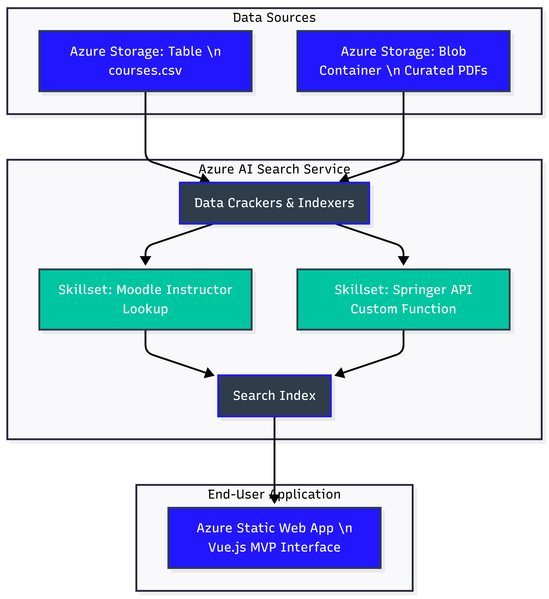
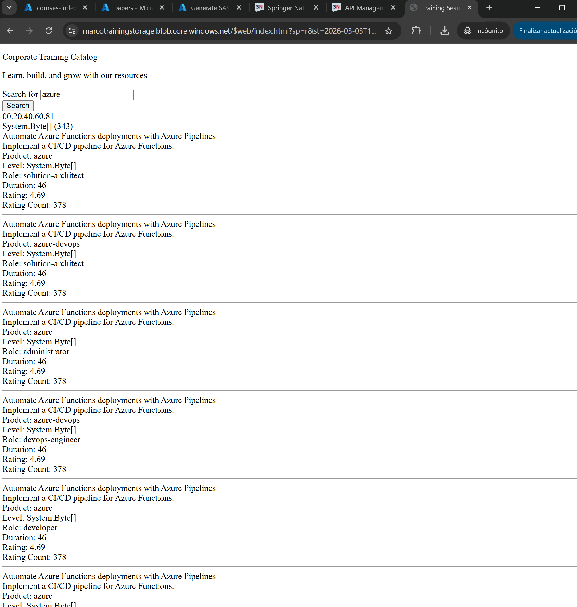

# AI-Enriched Corporate Training Catalog

## Overview
In my experience working with enterprise data management, one of the biggest bottlenecks for scaling a team is the friction involved in employee onboarding and continuous upskilling. Training materials are often siloed across internal platforms, third-party vendors, and scattered PDF libraries. 

I built this Azure AI Search solution to centralize these disparate data sources into a single, highly searchable catalog. By unifying internal courses, external training (e.g., Udacity, Microsoft Learn), and a curated library of open-access journals, this system directly reduces onboarding friction and empowers employees to perform self-serve skill-gap analysis.

## Architecture & Data Flow
The architecture relies on Azure Storage and Azure AI Search to ingest, enrich, and index the data before serving it to a Vue.js frontend. 

* **Data Sources:** * `courses.csv` (Azure Table Storage) containing internal and external course metadata.
  * Curated Research PDFs (Azure Blob Storage).
* **Search Engine:** Azure AI Search utilizing built-in cognitive skills (OCR, Entity Recognition) and custom Web API skills.
* **Frontend:** A Vue.js static web app deployed via Azure Storage `$web` container.

## AI Enrichments & Features
To maximize the business value of this catalog, the raw data is heavily enriched through the AI pipeline before indexing:

1. **Premium Internal Training Pipeline:** I implemented a Custom Conditional Skill that evaluates the `rating_average` of incoming courses. If a course is rated 4.5 or higher, it dynamically flags the course with a `SelectCourses = true` boolean. This gives HR an automated way to surface premium content to new hires. The logic is engineered to gracefully handle `null` ratings without failing the indexer.
2. **Internal Moodle Integration:** I used a Custom Entity Lookup skill to map internal course records to their respective Moodle instructor bios, enriching the search results with the instructor's background and expertise. 
3. **Springer API (Custom Azure Function):** For the highly technical staff reading the PDFs, basic OCR is insufficient. I deployed a serverless C# Azure Function (`SpringerLookup.cs`) that queries the Springer Open Access API to extract exact Publication Names, Publishers, and DOIs based on the PDF filenames.

## The Frontend Interface
The system connects to a Vue.js frontend that allows users to seamlessly search, filter, and facet the enriched data.

## Data Governance & Ethics Strategy
Coming from a Data Management & Governance background, I enforced strict policies during this build:
* **Data Minimization:** When enriching internal training with the Moodle instructor profiles, I ensured we only extracted the metadata strictly necessary for the employee catalog, avoiding the over-ingestion of PII.
* **Security:** The Vue.js frontend utilizes a restricted **Query Key** rather than an Admin Key to communicate with the Azure AI Search index, ensuring the underlying data architecture cannot be modified or compromised from the client side.

## Repository Contents
* `index.html`: The Vue.js frontend application.
* `SpringerLookup.cs`: The serverless C# function for the Springer API integration.
* `*.json`: The complete Azure AI Search schema definitions (Indexes, Indexers, and Skillsets for both the Blob and Table storage pipelines).
* Advanced Queries (`Step2_AdvancedQueries.txt` & `Step3_AdvancedQueries.txt`): Examples of complex filtering, faceting, and sorting logic used to extract actionable business intelligence from the final indexes.
* Monitoring & Metrics: Includes screenshots (`storage_used.png`, `performance_metrics.png`) demonstrating the system's operational health and query latency.
